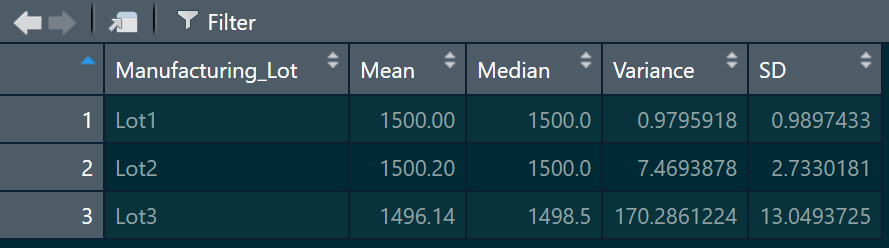

# MechaCar Statistical Analysis

## Linear Regression to Predict MPG
Using R, conducted a linear regression of the relationship between MPG (dependent variable) vs.:
- Vehicle length
- Vehicle weight
- Spoiler angle
- Ground clearance
- AWD

The results show a non-random amount of variance (low p-values) for vehicle length and ground clearance. 

Both of the 2 variables above indicate a strong correlation, with a slope of around 6 and 3.5 respectively. The slopes for the remaining variables are negligible, and very close to zero.

Since the intercept is also statistically significant, it contributes a significant amount of variability to the MPG when the other vairables are zero. This could indicate that the vehicle length and ground clearance might require scaling to improve the predictive power of the model.

## Summary Statistics on Suspension Coils
The design specifications for the MechaCar suspension coils dictate that the variance of the suspension coils must not exceed 100 pounds per square inch. The current manufacturing data meets this design specification for all manufacturing lots in total, with a value around 62, as shown below:

It does not, however meet the specification, on Lot #3:

## T-Tests on Suspension Coils
The t-tests for samples of Lots #1, 2, 3 show low p-values and means very close to 1,500 with 95% confidence for both lots #1 and #2. However, lot #3 has a high p-value (0.15), and a lower mean, indicating that values are skewed to the left.

## Study Design: MechaCar vs Competition
To compare how the MechaCar performs against the competition, a study could be performed to find the correlation between MPG and cost for the MechaCar and various other brands. 
 
We could start with a hypothesis that states the MechaChar has at least a 10% lower correlation (slope) on MPG vs. cost relation, compared to other brands; and a y-intercept (related to fixed costs) at least 20% lower than other brands.
The null hypothesis would state the opposite, that the MechaChar has a correlation of MPG vs. cost 10% higher; or a y-intercept 20% higher than any other brand.

To calculate this, first we would need to secure MPG and cost data for each car model on the other brands, as well as the MechaCar. Then, separate linear regressions would be performed of MPG vs. cost on the various models for each brand separately. A comparison of obtained slopes and y-intercepts for any results that have p-values lower than 0.05, should provide a decision for the hypothesis.